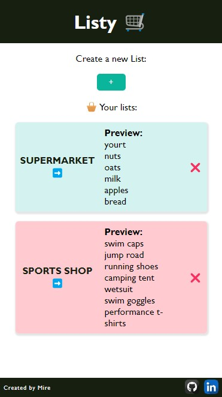
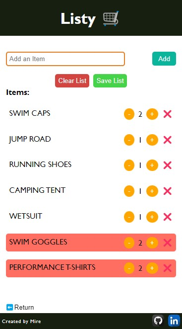

# 🛍️ Listy: Your Ultimate Shopping Companion! 📦

Welcome to Listy, your trusted shopping partner-in-crime! 🚀 Listy isn't just another shopping app; it's your digital shopping ally, meticulously crafted with the power of React. Bid farewell to the days of chaotic, disorganized shopping lists and usher in a new era of shopping efficiency.

  

  

## ✨ Standout Features of Listy

- **Seamless List Creation**: Crafting a new shopping list has never been easier. A single click is all it takes to embark on your shopping journey.

- **Personalized Shopping**: Listy empowers you with creative freedom, allowing you to personalize your lists with unique names and item details. It's like curating your shopping universe.

- **Effortless Item Addition**: Adding items to your list is as smooth as silk. Type away or hit 'Enter,' and watch your list come to life.

- **Shopping with Confidence**: Keep your shopping endeavors on point by marking items as 'shopped' with a simple tap. No more second-guessing.

- **Zen-Like List Clearing**: When your shopping extravaganza concludes, clear your list with a single, gratifying button click. It's pure retail therapy.

- **Preserve Your Lists**: Don't risk losing your cherished shopping lists. Safeguard them for future shopping quests.

- **User-Centric Design**: Listy spoils you with an intuitive, user-friendly interface that transforms shopping into a seamless experience.

## 🚀 Installation in 4 Simple Steps

1. **Clone this Repository**: Start your Listy journey by cloning this repository to your local machine:
   git clone https://github.com/your-username/listy-shopping-list.git

2. **Head to the Project Directory**:
   cd listy-shopping-list

3. **Install Dependencies**:
   npm install

4. **Launch the Development Server**:
   npm start

## 💡 How to Use Listy

1. **Start by Creating a Shopping List**: Initiate your shopping experience by effortlessly creating a new shopping list with a single click on the '+' button.

2. **Efficiently Populate Your List**: Populate your list with items in a breeze. Simply type them into the "Add an Item" field and press 'Enter' or utilize the 'Add' button.

3. **Stay Organized**: Maintain a well-organized shopping spree by marking items as 'shopped' with a quick tap. No more confusion about what's left to buy.

4. **Effortless List Clearing**: Once you've successfully tackled your shopping mission, clear your list with a single, decisive click on "Clear List."

5. **Secure Your Shopping Masterpiece**: Preserve your carefully curated shopping list by navigating to a custom URL with the list name in the address bar.

6. **Quick Access to Your Lists**: All your saved lists are conveniently accessible with a single click on the homepage.

Happy shopping with Listy 🛒!
